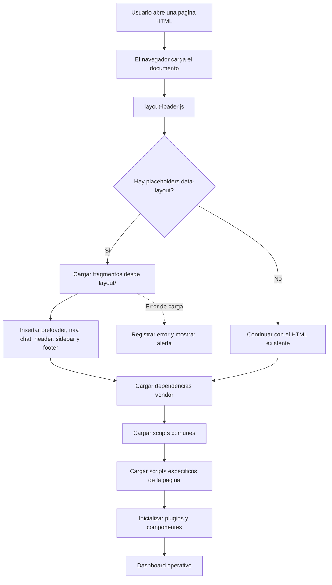

# Template Iris 👁️

[](https://www.linkedin.com/in/drphp/)
[](https://www.linkedin.com/in/drphp/)

<a href="https://www.instagram.com/amvsoft.tech/">
  
</a>

## Descripción

Template Iris es una plantilla de administración hospitalaria construida como una aplicación web estática. El proyecto utiliza HTML, CSS y JavaScript vanilla, junto con las dependencias incluidas en `vendor/`. No requiere un proceso de compilación ni un backend para visualizar las páginas.

## Requisitos

- Apache HTTP Server o cualquier servidor web estático.
- Un navegador moderno con soporte para `fetch`, `XMLHttpRequest` y JavaScript.
- Git, si se desea clonar el repositorio.

## Puesta en marcha

### Clonar el proyecto

```bash
git clone https://github.com/phpeitor/template-iris.git
cd template-iris
```

### Servir la aplicación

No se recomienda abrir los archivos directamente con `file://`, porque el navegador puede bloquear la carga de los layouts. Configura el directorio como un sitio de Apache y accede a `index.html` mediante HTTP:

```text
http://localhost/template-iris/
```

En un entorno local con Apache, la raíz publicada debe apuntar a la carpeta del proyecto. También puede utilizarse cualquier servidor estático equivalente.

## Arquitectura y responsabilidades

Las páginas del dashboard reutilizan los componentes comunes ubicados en [`layout/`](./layout/):

- `preloader.html`: indicador de carga inicial.
- `nav.html`: navegación principal y marca.
- `chat.html`: panel de chat.
- `header.html`: barra superior.
- `sidebar.html`: menú lateral.
- `footer.html`: pie de página.

Cada página del dashboard declara placeholders `data-layout` y carga [`js/layout-loader.js`](./js/layout-loader.js). El loader reemplaza esos placeholders por el HTML correspondiente antes de ejecutar los scripts de la página.

La responsabilidad de cada capa está separada:

- HTML: estructura, contenido, accesibilidad y referencias a recursos.
- `layout/`: fragmentos HTML compartidos por el shell del dashboard.
- `css/style.css`: estilos globales de la plantilla.
- `css/pages/`: estilos exclusivos de una página.
- `js/layout-loader.js`: inserción de layouts compartidos.
- `js/custom.min.js` y `js/deznav-init.js`: comportamiento común del dashboard.
- `js/pages/`: comportamiento JavaScript exclusivo de una página.
- `js/dashboard/` y `js/plugins-init/`: inicializadores y funcionalidades específicas existentes.
- `vendor/`: dependencias de terceros distribuidas localmente.

No se deben añadir bloques `<style>`, bloques `<script>` inline ni atributos `style` en las páginas HTML. Los estilos específicos deben vivir en `css/pages/` y la lógica específica en `js/pages/` o en el directorio funcional existente que corresponda. Los scripts deben conservar el orden de dependencias requerido por cada página.

Las páginas de autenticación y error son excepciones: mantienen su estructura independiente porque no utilizan el shell del dashboard.

## Flujo de carga



El loader se ejecuta antes de los scripts que dependen del shell. Si un fragmento no puede cargarse, el error se registra en la consola y se muestra una alerta visible en la interfaz.

## Estructura relevante

```text
.
├── css/                 # Estilos de la plantilla
│   └── pages/           # Estilos específicos por página
├── images/              # Imágenes, logos y avatares
├── js/                  # Lógica común e inicialización
│   ├── dashboard/       # Scripts de dashboards y vistas funcionales
│   ├── pages/           # Scripts específicos por página
│   └── plugins-init/    # Inicialización de plugins
├── layout/              # Fragmentos HTML reutilizables
├── vendor/              # Dependencias frontend distribuidas localmente
├── index.html           # Dashboard principal
└── *.html               # Vistas del dashboard y páginas auxiliares
```

## Desarrollo

1. Inspecciona primero la página, sus dependencias y los patrones existentes.
2. Mantén los componentes compartidos en `layout/`; no los dupliques dentro de las páginas.
3. Mantén el HTML dedicado a estructura y contenido; no agregues CSS ni JavaScript embebido.
4. Coloca estilos exclusivos en `css/pages/<pagina>.css`.
5. Coloca lógica exclusiva en `js/pages/<pagina>.js` o en el módulo funcional existente.
6. Carga `js/layout-loader.js` antes de los scripts que dependen de elementos del layout.
7. Conserva el orden original de las dependencias y scripts de inicialización.
8. Usa rutas relativas para que las páginas funcionen bajo cualquier subdirectorio del servidor.
9. Verifica cada página modificada desde Apache y revisa la consola del navegador ante errores de carga.

## Validación rápida

Después de modificar un layout o una página:

1. Abre la página mediante HTTP, no mediante `file://`.
2. Confirma que aparecen el encabezado, el menú lateral, el chat y el pie de página.
3. Comprueba que los controles propios de la página siguen funcionando.
4. Revisa que no existan errores de red ni errores JavaScript en la consola.
5. Confirma que no existen etiquetas `<style>`, `<script>` inline ni atributos `style` en el HTML modificado.
6. Ejecuta `node --check` sobre los archivos JavaScript modificados.
7. Ejecuta `git diff --check` antes de finalizar.

## Criterios de calidad

- Los cambios deben ser pequeños, trazables y limitados al alcance solicitado.
- Se deben reutilizar layouts, clases y utilidades existentes antes de crear duplicados.
- Las rutas, nombres de archivos y dependencias deben corresponder a recursos reales del repositorio.
- Los errores de carga deben ser visibles y diagnosticables; no se deben ocultar con fallbacks silenciosos.
- Toda modificación debe conservar el comportamiento existente salvo que el cambio solicitado indique lo contrario.

## Licencia y atribución

Consulta la información de licencia incluida en el repositorio y conserva las atribuciones de los recursos de terceros al redistribuir la plantilla.
